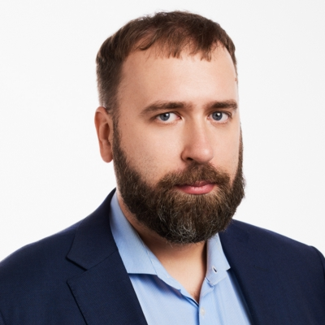

# Tomas Kasparaitis

> Address: **Girulių street 7-45, LT - 12124 Vilnius Lithuania**
>
> Phone.: **+37060038422**
>
> Email.: **[tomas.Kasparaitis@gmail.com](mailto:tomas.Kasparaitis@gmail.com)**

## EDUCATION

### University studies:
*2002 – 2017* The University of Vilnius (VU) – The Bachelor‘s degree – the computer science
### Secondary school education:
*1990 – 2002* The Gymnasium “Versmė” in Elektrėnai
## WORK EXPERIENCE
### 2018 07 - current *UAB "Šviesa"*
**Developer**

Education projects. (Postrgre SQL, MongoDB, Python, Angular)

### 2017 06 - 2018 07 *UAB "Worapay"*
**Senior Developer**

WioPay app and backend development. (Mysql, Python, Cordova, Java)

### 2017 01 - 2017 06 *UAB "EUROMONITOR INTERNATIONAL - EASTERN EUROPE"*
**Database Developer**

Development with MS SQL. Chat bot with Node.js + [Dialogflow](https://dialogflow.com/).

### 2015 06 - 2017 01 *UAB Paysera LT*
**Developer/B2B support team lead**

The creation of the e-commerce integrations for different platform. Working with
Paysera LT banking solutions (Transfer API, user identification and other).
Creating reports from diferent source of data (SQL + ElasticSearch).

### 2013 10 - 2015 06 *UAB Paysera LT*
**Developer/B2B tech support**

Creating different solutions to connect client systems/services with Paysera API.
Preparing solutions and documentation. Preparing different reports from
relational databases and other sources.

### 2012 01- 2013 10 *UAB SC Baltic Media*
**Developer**

The creation of the web sites (Wordpress). – custom functionality of the web sites:
for example, payments, bridge between 2 sites, site and Android/IOS applications.
The updating of the existing modules and the creation of the new models.
The programming work related to the non-standard projects: facebook
applications, minipages, custom surveys, marketing tools etc.

### 2010 08 – 2012 01 
**Freelance Developer**

The creation of the web sites (Wordpress). – creation of the managment system to
update 20+ blogs from RSS and other web services
The creation of the web shops (Tomatocart, Magento, Wordpress). – custom
design solutions, payments.
The work related to the optimization of the web sites to the Search engines.

The programming work related to the non-standard projects: betting web site,
custom interface for Asterisc (open source framework for building the
communications‘ applications)

### 2009 09 – 2010 08 *UAB “IT Grupa”*
**Developer**

The creation and the updating of the modules of Joomla web content.

### 2007 06 - 2009 01 UAB *“Alpha komunikacijos 2”*
**Developer**
The creation and the maintenance of the systems related to the management of
the client and the services. – from client search to the client routers‘ configuration
for the creation of the bills every month.
The improvement of the IP television platform, the creation of the new services:
the connection of the client managment system with the concurrent MediaHawk
system and changing UI, the creation of the games for IPTV.

### 2007 01 - 2007 06 *UAB “PBMH”*
**Developer**

The creation of the surveys and the new functionality, the custom solutions with
JavaScript.
### 2006 02 - 2006 09 *UAB “Idamas”*
**Developer**

The creation and the amendment of CMS modules.
Webservices, [Amadeus](http://amadeus.com) based flight booking system.

### 2005 03 - 2006 02 *UAB “Cornet-Solutions”*
**Developer**

The Administration of the projects, the creation of TVS modules and other
relevant work in the field of programming.
Creation of the software for sending the multipart newsletter and the creation of
the managment system related to the small customers.

## LANGUAGES

LANGUAGE | WRITING | SPEAKING | COMPREHENSION | EXPERIENCE | LAST TIME USED
-------- | ------- | -------- | ------------- | ---------- | --------------
Lithuanian | Excellent | Excellent | Excellent | Native tongue | Currently
Russian | Middle | Good | Good | 25 years | Currently
English | Middle | Good | Good | 15 years | Currently
German | Middle | Middle | Middle | 5 years | 10 years ago
## IT SKILLS
### PROGRAMING LANGUAGES
* **PHP** 15 years
* **JavaScript** 15 years
* **Node.JS** 3 year
* **Python** 4 year
* **C++** 3 years
* **Java** 4 years
### DATABASES (and More)
* **Mysql/MariaDB** 15 years
* **MsSql** 3 years
* **PostgreSql** 2 year
* **Apache Cassandra** 1 year
* **MongoDB** 2 year
* **Memcache** 1 year
* **Elasticsearch** 1 year
### JAVASCRIPT FRAMEWORKS
* **jQuery** 7 years
* **jQuery Mobile** 2 year
* **Angular** 2 year
* **Framework7** < 1 year
* **MooTools** 5 years
* **Prototype** 2 years
* **YUI Library** 1 year
## CONTENT MANAGMENT SYSTEMS
* **Wordpress** 6 years
* **Joomla** 8 years
* **Magento** 2 years
* **TomatoCart** 2 years
* **CMS Made Simple** 1 year
## HOBBIES
**Sport activities:** Squash, walking, swimming, snowboarding.
Camping and travels.

Socializing with colleagues and friends.
## RECOMMENDATIONS
**Mantas Šegžda** Head of Programming Development, WorldOne Research
managed Tomas at WorldOne Research (UAB „PBMH“).

**Mary Anne Donovan** St. John Fisher College - Adjunct Professor, Technical Communication

**Skaistė Knyzaitė** CEO at AviationCV.com

**Andrius Rekerta** Head of Data Communication Department ad "Baltnetos Komunikacijos"
## ONLINE RESOURCE
**Linkedin** [https://lt.linkedin.com/in/tokas](https://lt.linkedin.com/in/tokas)

**Home page** [http://kasparaitis.lt/](http://kasparaitis.lt/)